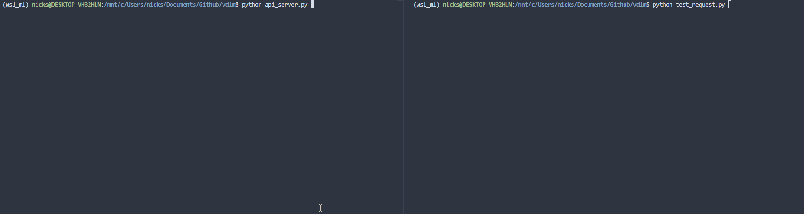

## VDLM Overview

VDLM is a model inference framework for running language MDMs (masked diffusion models) w/ an OpenAI style API.

### Running the server

```
python api_server.py
python test_request.py
```

### Demo
**Video sped up for demonstration purposes**



### Tests

Written in pytest, run using `pytest`
 - tests runs server w/ mock engine loop by default rather than loading a real model

### Work in Progress
 - add more architectures, current code only uses LLaDA
 - implement CUDA graph capture for model serving
 - cancellable engine requests
 - dynamic request batching
 - faster IPC using `ZMG` + `msgpack` over `multiprocessing.Queue`

### Acknowledgements

Model generation + load config code is from [fast-dLLM](https://github.com/NVlabs/Fast-dLLM).
 - [slight modification added](https://github.com/NVlabs/Fast-dLLM/pull/51) to the original RoPE implementation for torch compilability
    - some numerical precision issues observed, see link for more info